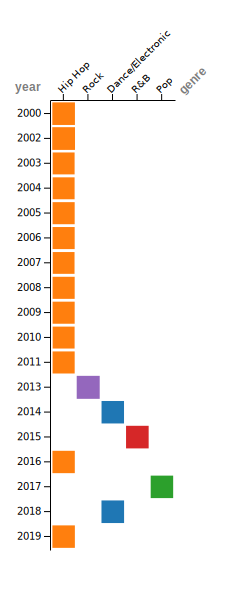
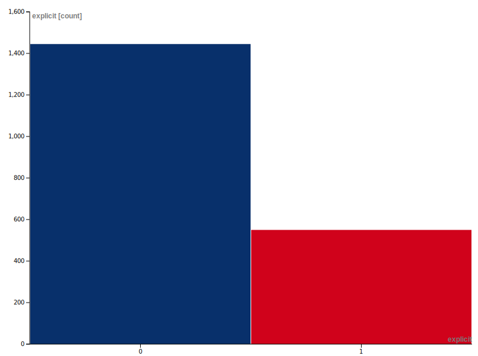
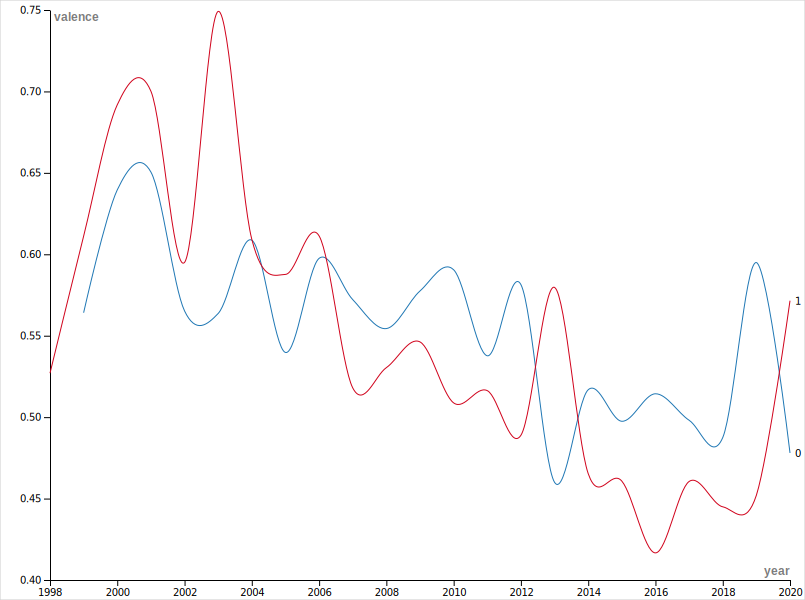

# Abstract: 
This analysis attempts to define a formula for creating a hit song with the ability to remain relevant over time by reviewing the qualities of the 2000 most popular songs in 2022 on Spotify whose release occurred between 2000 and 2019. Studies into hit song science and music information research have produced countless formulas for hit songs. However, it is unclear if their focus has been to find a formula specifically geared towards legacy over short term gains as this analysis attempts to do. Through the use of RawGraphs.io, Microsoft excel, and ChatGPT, the formula for a song with long lasting relevance is a Hip-Hop track about romance/love, with explicit yet positive lyrics, and in the key of C#/Db.
# Introduction: 
Intrinsically tied to any generation’s identity is the popular music it produced. Through publications like Billboard Magazine and The Rollingstone, sales and streaming statistics, as well as industry awards like the Grammys or Junos, the impact of a piece of music at the time of its release is easily gauged. However, the impact and relevance of that same piece of music over time is not as easily measured.  Hit Song Science (HSS), and Music Information Research (MIR)[1](#1) are two fields of study that attempt to quantify what makes a song popular. Short term formulas have been developed that can predict with some accuracy how well a song might do, or even how long it will remain on the charts. However, as this 2022 study [2](#2) using Spotify’s Web API tool[3](#3) demonstrates, such formulas are only accurate while public opinions remain static. As tastes evolve, the formula needs to be adjusted or rewritten entirely. Despite changes in listener preference over time, some songs manage to remain popular. Often the songs that persevere are not the biggest hits of their day. 
Building from my previous report, this analysis intends to determine if there is a commonality between songs that have remained popular over time. Excluding musical preference inherited from the previous generation was a bias that needed to be considered. In a 2013 study by Cornell,[4](#4) 62 college aged participants were played samples from Billboard hits going back to 1955. They were then asked to rate the songs quality, how much they enjoyed it, and whether they were familiar with it. It was found that as well as music from their generation, participants showed a preference for music from approximately ten years before they were born.  Which would be around the time their parents would have been college aged. There was a similar, but smaller trend approximately thirty years prior to their birth which would coincide with their Grandparents college age. It is likely that this preference was handed down from their parents through the music played in the home while they were growing up as an “intergenerational transmission” [4](#4). To correct for this, this analysis will cover a twenty-year span. Because over fifty percent of Spotify users are between the age of 18 and 30[5](#5), it is unlikely that their parents bias will have had much effect on their opinion of the music in question. Instead of the generational nodes present in the Cornell study, there should be clear trends in songs that have remained relevant. The dataset used in this study came from a list created by Mark Koverha using [6](#6) using Spotify’s Web API tool, which assigns a score to various qualities of music, including explicit content, energy, loudness, danceability, and a measurement of the positivity of the lyrical content referred to as the valence, among several others. 

# Methods:
This analysis used a dataset[6](#6) of the 2000 most popular songs on Spotify from the year 2000 to 2019, based on 2022 listening statistics. To be clear, this is not the most popular songs from the years they were released, this is popularity based on current listenership on Spotify.  The list was generated using the Spotify Web API[3](#3) factoring in individual streams, as well as inclusion in playlists. The current user base for Spotify is over 50 percent between the ages of 18 and 30[5](#5).  The gender split is 56% male and 44% female, with no data in reference to gender outside of the binary.  Spotify for Developers includes qualifiers for duration in milliseconds, explicit content, year of release, current popularity,	danceability, energy, key the song is written in, loudness measured in dBfs, mode (major or minor), speechiness (talking instead of singing), acousticness (use of acoustic instruments over electric or digital),	instrumentalness (lacking vocals), liveness (versus overly produced or polished), valence (positivity of the lyrics), tempo, and genre. This data was found on Kaggle.com as a .csv file by searching for “songs marked as explicit by year”.  
The next stage in analysis was to order and clean up the data. A few entries were duplicates. As well, the original delineation for explicit content was True (explicit) or False (not explicit). These values were changed to 1 or 0 respectively to allow for those values to be handled as numbers. 
The cleaned data was then uploaded to Rawgraphs.IO where it was converted into several visualizations. Using these visualizations to find trends or patterns, a side by side matrix plot of the most popular song of a given year based on current data compared to the Billboard top song for that year[7](#7) indicated Hip-Hop to be the preferred genre. A bar chart comparing explicit vs clean songs provided the total of 550 songs with explicit content, 426 of which were Hip-Hop tracks. 
The saturation of explicit tracks in the Hip-Hop genre required a more granular analysis. The top 20 Hip-Hop and top 20 overall tracks by popularity were fed into ChatGPT with the prompt ‘Are you able to find common themes in the lyrics to these songs’. The main common theme between Hip-Hop and all other genres was then used to create a new list which was used to find further correlations. 

# Results:
The outcome of the analysis found that based on historical data, the most likely song to be a hit in 2022 would be a Hip-Hop track about romance/love, with explicit yet positive lyrics, and in the key of C#/Db.
.svg)
> The size of the segment indicates the relative popularity of songs in each key. As well the numbers beneath the Key name indicate in order, 0 (majority clean) or 1 (majority explicit), and the number of explicit tracks in the key.
>
> 
The first trend that became apparent was a trend towards Hip-Hop as a genre. When sorting by top song according to the years of release, Hip-Hop accounted for 8 of the 20 tracks. When compared to current statistics, that number nearly doubles to account for 15 of the 20 tracks. 
.svg) 
> *left* Top Billboard track's genre in the year it was released *right* Top track's genre by 2022 Spotify statistics
> 
This rise in popularity of Hip-Hop seemed to indicate that a specific element of the genre was appealing to modern audiences. One possibility was the use of explicit language. 
In this chart, ‘0’ indicates a clean song in blue and ‘1’ indicates an explicit song in red. Explicit content accounts for 550 tracks in the 2000 track set. Hip-Hop accounts for 426 of those tracks. 

>**Blue** Clean **Red** Explicit

The top 20 most popular Hip-Hop songs on the list were fed into ChatGPT and given the prompt “Are you able to find common themes in the lyrics to these songs”. The first theme identified was Self-expression, defiance, expressing oneself, standing up against authority or societal norms, and being unapologetically true to oneself. This was also identified by ChatGPT to be the most popular theme in the set of Hip-Hop tracks. When given the same prompts and a list of the top 20 songs overall regardless of genre, the top theme was Relationships, love, heartbreak, longing, intimacy, and the emotional rollercoaster of love. Which was the second most popular theme for the Hip-Hop set. ChatGPT provided a list of which songs were considered for each theme. A list was compiled of ‘Hip-Hop’ and ‘All Genre’ tracks falling under ‘Relationships and Love’ in Excel. From that list it was determined that although in that theme Pop songs were slightly more popular, positive Hip-Hop with clean lyrics was a formula that produced hits. 

# Discussion:
It would be an industry changing power if this analysis was as effective at predicting hit songs as it seems. Contrary to these findings however, the biggest hit song for 2022 was “As it Was” by Harry Styles[8](#8). A song which is not Hip-Hop, clean, in F#, and about longing for a previous life. Which is closer to the theme defined by ChatGPT as ‘Emotional Struggles and Personal Introspection’. A significant departure from the predicted Hip-Hop track about romance/love, with explicit yet positive lyrics, and in the key of C#/Db. This is an outcome that Johanna Drucker would have predicted as they have described visualization tools as digital humanity’s ‘Trojan Horse’[9](#9). The danger of working with data visualizations like RawGraphs.io is that the implied authority they carry. While finding commonalities between popular songs is a simple process, determining the combination that will result in a success is not dissimilar to alchemy.  

>**Blue** Clean **Red** Explicit

While there has been a clear decline in the positivity of lyrics over time, the use of explicit lyrics has remained constant when compared with clean lyrics. Finding explicit lyrics to be a trend in this case could have been any of the other 16 qualities assigned by Spotify to these songs. Applying Bruno Latour’s Actor Network Theory[10](#10) to this or any music based dataset would produce an incredibly complicated network. The interconnected nodes within it would remove any easily definable generalities like ‘Genre’ or ‘Valence’. Each song would be revealed to be freestanding and unique, while simultaneously affecting and being affected by all other nodes in the network. 
It is also worth noting the difference between the songs that were most popular in the years they were released compared to songs of the same year released now. In only two of he twenty years were the same song in the top spot now as in the past. Those were 50 Cent’s ‘In Da Club’[11](#11) and Usher’s ‘Yeah!’[12](#12). While there is no secret formula for creating a guaranteed hit song, there is an argument to be made for Hip-Hop as the genre with a lasting legacy. 
<iframe src='https://cdn.knightlab.com/libs/timeline3/latest/embed/index.html?source=12nxEVjep_fCJQX-akOb-KJBtMP1dU4w7OVYdwPcdAs4&font=Default&lang=en&initial_zoom=2&height=650' width='100%' height='650' webkitallowfullscreen mozallowfullscreen allowfullscreen frameborder='0'></iframe>

# References:
##### 11
50 Cent. In Da Club. Aftermath- Shady- Interscope, 7 Jan. 2003.
##### 9
Drucker, Johanna. “DHQ: Digital Humanities Quarterly: Humanities Approaches to Graphical Display.” Digital Humanities Quarerl, vol. 5, no. 1, May 2011, http://www.digitalhumanities.org//dhq/vol/5/1/000091/000091.html#p2.
##### 1
 Karydis, Ioannis, et al. “Musical Track Popularity Mining Dataset: Extension & Experimentation.” Neurocomputing, vol. 280, Mar. 2018, pp. 76–85. ScienceDirect, https://doi.org/10.1016/j.neucom.2017.09.100.
##### 4
Krumhansl, Carol Lynne, and Justin Adam Zupnick. “Cascading Reminiscence Bumps in Popular Music.” Psychological Science, vol. 24, no. 10, Oct. 2013, pp. 2057–68. DOI.org (Crossref), https://doi.org/10.1177/0956797613486486.
##### 10
Latour, Bruno, and Science Studies-San Diego. On Actor-Network Theory. A Few Clarifications plus More than a Few Complications.
##### 7
Magazine, Billboard. “Hot 100 Songs – Billboard.” Hot 100 Songs - Billboard, https://www.billboard.com/charts/year-end/2020/hot-100-songs/. Accessed 24 Feb. 2023.
##### 2
Sharma, Dolly, et al. “Performance Prediction of Songs on Online Music Platforms.” Databases Theory and Applications, edited by Wen Hua et al., Springer International Publishing, 2022, pp. 209–16. Springer Link, https://doi.org/10.1007/978-3-031-15512-3_19.
##### 5
Spotify Statistics: Users, Artists, Revenue And More! 6 Feb. 2023, https://www.searchlogistics.com/learn/statistics/spotify-statistics/.
##### 8
Styles, Harry. As It Was. Digital, Erskine- Columbia, 1 Apr. 2022.
##### 6
Top Hits Spotify from 2000-2019. https://www.kaggle.com/datasets/paradisejoy/top-hits-spotify-from-20002019. Accessed 17 Apr. 2023.
##### 12
Usher, et al. Yeah! Arista, 26 Jan. 2004.
##### 3
Web API | Spotify for Developers. https://developer.spotify.com/documentation/web-api. Accessed 17 Apr. 2023.

